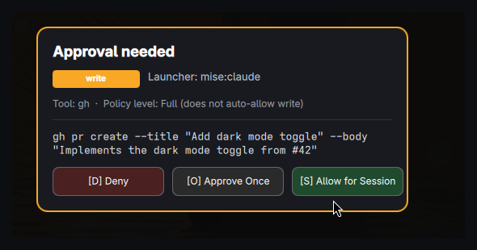

# CmdWarden-Omarchy

**Gate what your AI harness (or anything else) can do with `gh`, without
changing `gh` itself.**

CmdWarden-Omarchy is a real, working Inspired Twin of Windows
[CmdWarden](https://github.com/BasantPandey/CmdWarden) for Omarchy (Arch
Linux + Hyprland) and other systemd/D-Bus/Wayland Linux desktops: a Session
Agent, a Launcher identity model, a policy engine, a Secret Service vault, a
real on-screen Approval Gate, and a Shim that intercepts `gh` — wired
together end to end and verified live, not just designed on paper. See
[Status](#status) for exactly what that means.

## Table of contents

- [Why](#why)
- [What it does](#what-it-does)
- [Status](#status)
- [Platform support](#platform-support)
- [Requirements](#requirements)
- [Installation](#installation)
- [Quick start](#quick-start)
- [Configuration](#configuration)
- [State and data locations](#state-and-data-locations)
- [Uninstalling / reversing everything](#uninstalling--reversing-everything)
- [Troubleshooting](#troubleshooting)
- [Security model, in brief](#security-model-in-brief)
- [Documentation](#documentation)
- [Building from source](#building-from-source)
- [Releases](#releases)
- [Contributing](#contributing)
- [Explicit non-goals (v1)](#explicit-non-goals-v1)
- [License](#license)

## Why

Anything you run in your terminal — a shell, an AI coding harness, a script
— inherits your full `gh` credentials with no gate in between. If it can run
`gh`, it can open PRs, change repo settings, or read a token good enough to
do either. CmdWarden-Omarchy puts a real gate there: policy decides what
auto-allows by *who's calling* and *what they're trying to do*; anything
riskier pops a real approval prompt; every decision is logged; and the
credential itself is only ever handed to a child process that was actually
approved.

## What it does



*A real gate, popped live for a `gh pr create` — not a mockup. Every field
comes from the actual identity resolution and policy decision described
below.*

- **Resolves who's really calling** (`internal/identity`) by walking process
  ancestry to the first real Launcher and classifying its Provenance Channel
  — `mise:claude`, `pacman:foot`, or a path+hash Unmanaged identity — not a
  self-reported name a caller could lie about.
- **Decides by policy** (`internal/policy`): a Deny/Read/Trusted/Full ×
  read/write/secret-reveal/unknown auto-allow matrix, with explicit-only
  enrollment (`cw policy enroll`) and an unenrolled Launcher defaulting to
  Deny.
- **Pops a real Approval Gate** when policy doesn't auto-allow: a genuine
  Wayland layer-shell surface (Quickshell), not a stub — Deny / Approve Once
  / Allow for Session, each one actually returned to the agent and acted on.
  Allow for Session persists across subsequent calls from the same process
  until it exits or goes idle — no re-prompting for every call.
- **Vaults `gh`'s token** (`internal/secretservice`) in the freedesktop
  Secret Service (the same store `gh` itself uses) and releases it only
  into the one child process a gate decision just approved — never printed,
  never left in a parent shell's environment.
- **Intercepts `gh` with a Shim** (`internal/shim`) that adapts to how it's
  installed: an Occupied Shim (binary renamed aside, in place) for
  mise-managed tools, a Path Shim (PATH-prepended, real binary untouched)
  for pacman-managed ones. `cw doctor` detects Pin Drift if a later install
  (e.g. a version upgrade) silently un-gates the tool.
- **Logs every decision** (`internal/audit`) to an NDJSON trail that
  structurally cannot carry a secret value or a full command line, and
  fails closed if the log itself can't be written.

Read [`docs/architecture.md`](docs/architecture.md) for how these fit
together, or [`docs/cli-reference.md`](docs/cli-reference.md) for every `cw`
command.

## Status

This repo is the **gh-only Compat Mode Spike Vertical**: all 11 tickets on
the [wayfinder map](https://github.com/BasantPandey/CmdWarden/issues/10) are
closed, and the full path — Shim → Session Agent → Launcher identity →
Vault → Approval Gate → real `gh` — has been verified live on a real Omarchy
machine against a real, actively-used `gh` install, including: Deny actually
blocking a real `gh pr create`-style command; Approve Once allowing exactly
one call; Allow for Session persisting across a second call with zero
re-prompt; and a correctly-classified audit row for every one of those. It
is **one tool** (`gh`), proving the model before generalizing it — see
[Explicit non-goals](#explicit-non-goals-v1).

This is a young project (spike-vertical stage): expect the CLI surface and
on-disk formats to still move. Pin a release tag rather than tracking `main`
if you need stability.

## Platform support

Developed against and tested on **Omarchy** (Arch Linux + Hyprland), but the
design is mostly generic **systemd + D-Bus + wlroots-Wayland Linux** —
Omarchy is where it's proven, not an architectural requirement. The one
Omarchy/Arch-specific piece is `pacman`-based Provenance Channel detection,
which degrades gracefully (falls back to path+hash Unmanaged identity)
anywhere `pacman` isn't the package manager. See
[Platform requirements and portability](docs/architecture.md#platform-requirements-and-portability)
for the full breakdown.

Not supported: macOS, Windows, X11-only sessions, or non-systemd init
systems (OpenRC, runit, ...) — the Session Agent's lifecycle is
systemd-`--user`-specific.

## Requirements

| Requirement | Why | Notes |
|---|---|---|
| Linux | everything | tested on Arch (Omarchy) |
| `systemd --user` | Session Agent socket activation | standard on most desktop distros |
| D-Bus session bus | agent RPC, Secret Service | standard on any Linux desktop |
| A freedesktop Secret Service provider | vault | gnome-keyring, KWallet, keepassxc, ... — most desktops already run one |
| A `wlr-layer-shell`-capable Wayland compositor | Approval Gate UI | Hyprland, Sway, and other wlroots compositors; not X11 |
| [Quickshell](https://quickshell.org) | Approval Gate UI | `qs` must be on `PATH` |
| Go 1.27.1+ | building from source | see [Building from source](#building-from-source) |
| [`gh`](https://cli.github.com) | the tool being gated | any recent version |

## Installation

### From a release (recommended)

Download the tarball for your architecture from the
[latest release](https://github.com/BasantPandey/CmdWarden-Omarchy/releases/latest)
and extract it:

```sh
tar -xzf cmdwarden-omarchy-<version>-linux-<amd64|arm64>.tar.gz
cd cmdwarden-omarchy-<version>-linux-<amd64|arm64>
sudo install -m 0755 cw cmdwarden-agent /usr/local/bin/
```

(Or skip `sudo install` and just keep `cw`/`cmdwarden-agent` in a directory
on your `PATH` — `cw agent install` finds `cmdwarden-agent` next to `cw` if
it's not separately on `PATH`.)

### From source

See [Building from source](#building-from-source).

### Verifying a release download

Every release artifact ships with a `.sha256` file:

```sh
sha256sum -c cmdwarden-omarchy-<version>-linux-<amd64|arm64>.tar.gz.sha256
```

## Quick start

```sh
cw agent install        # writes + enables the systemd --user socket unit
cw doctor                # lazy-starts the agent, confirms it's healthy

cw policy enroll --kind ai-harness   # enroll the calling Launcher (defaults to Read)
cw harden gh                          # import gh's token, install the Shim

gh pr create ...                      # now gated
```

Full command reference: [`docs/cli-reference.md`](docs/cli-reference.md).

## Configuration

CmdWarden-Omarchy is intentionally config-file-free — everything is either
a CLI flag, an on-disk state file managed by `cw` itself (see
[State and data locations](#state-and-data-locations)), or one of these
environment variables:

| Variable | Default | Effect |
|---|---|---|
| `CW_SESSION_IDLE_SECONDS` | `3600` | how long an "Allow for Session" grant survives with no covered calls |
| `MISE_DATA_DIR` | `~/.local/share/mise` | where Launcher/Shim identity resolution looks for mise's install tree |
| `GH_CONFIG_DIR` | `$XDG_CONFIG_HOME/gh` or `~/.config/gh` | where `cw vault import gh` looks for `gh`'s own `hosts.yml` |
| `GH_TOKEN`, `GITHUB_TOKEN` | — | checked first when importing `gh`'s active token for `github.com`/`localhost` (matches `gh`'s own resolution order) |
| `GH_ENTERPRISE_TOKEN`, `GITHUB_ENTERPRISE_TOKEN` | — | same, for any other host |
| `XDG_RUNTIME_DIR` | required by systemd | the agent's activation socket lives here |
| `XDG_STATE_HOME` | `~/.local/state` | audit log, policy store, shim pins |
| `XDG_DATA_HOME` | `~/.local/share` | Path Shim directory + its PATH bootstrap script |
| `XDG_CONFIG_HOME` | `~/.config` | systemd unit install location |
| `WAYLAND_DISPLAY` | set by your session | required for the Approval Gate to render; its absence is a fail-closed condition, not a crash |

## State and data locations

| Path | Contents |
|---|---|
| `~/.local/state/cmdwarden/gate-decisions.ndjson` | the audit trail (`cw audit`) |
| `~/.local/state/cmdwarden/policy.json` | enrolled Launchers and their policy levels |
| `~/.local/state/cmdwarden/shims.json` | installed Shim pins (tool → channel/path/mode) |
| `~/.local/share/cmdwarden/shims/` | Path Shim scripts (pacman-provenance tools) |
| `~/.local/share/cmdwarden/shim-env-bootstrap.sh` | the PATH-prepend script Path Shims need |
| `~/.config/systemd/user/cmdwarden-agent.{socket,service}` | the Session Agent's systemd units |
| freedesktop Secret Service, collection `CmdWarden` (or the backend's default collection if creating a new one isn't possible) | vaulted secrets (e.g. `gh`'s token) |

None of these are meant to be hand-edited — use the `cw` subcommands
(`cw policy`, `cw shim`, `cw vault`, `cw audit`) to read or change them.

## Uninstalling / reversing everything

Everything CmdWarden-Omarchy does is designed to be fully reversible:

```sh
cw unharden gh              # Shim removed, real gh restored, vault entry deleted
cw shim uninstall --tool <name>   # for any other Shimmed tool
cw agent stop                # stop the running agent
cw agent uninstall           # disable + remove the systemd units
```

`cw shim uninstall` on the last remaining Path Shim also removes the PATH
bootstrap script and its sourcing lines from `~/.bashrc`, `~/.profile`,
`~/.zshrc`, `~/.config/uwsm/env.d/50-cmdwarden`, and
`~/.config/environment.d/50-cmdwarden-shim.conf` — leaving no trace in your
shell startup files. Policy enrollment (`cw policy unenroll`) and vaulted
secrets (`cw vault delete`) are separate, explicit steps if you want to
remove those too.

## Troubleshooting

- **`cw doctor` reports the Session Agent unhealthy** — check
  `systemctl --user status cmdwarden-agent.socket` and
  `journalctl --user -u cmdwarden-agent.service`. Most often this means the
  unit was never installed (`cw agent install`) or `cmdwarden-agent` isn't
  on `PATH`/next to `cw`.
- **`cw doctor` reports Pin Drift** — a Shimmed tool's current resolution no
  longer matches its harden-time pin (commonly: the underlying tool was
  upgraded via mise, which changes its concrete install path). Re-run
  `cw harden <tool>` — it's always safe to re-run.
- **The Approval Gate never appears; the command just hangs, then fails
  closed after ~5 minutes** — check `WAYLAND_DISPLAY` is set in the
  session the agent runs in, and that `qs` (Quickshell) is on the agent's
  `PATH`. `journalctl --user -u cmdwarden-agent.service` will say which.
- **A gated command is denied and you didn't expect it** — check
  `cw policy list` (is the Launcher enrolled, at what level?) and
  `cw audit` (what class did the command classify as, and why was it
  denied — see the `reason_code` field).
- **`cw vault import gh` fails** — it looks for `gh`'s active token via
  `GH_TOKEN`/`GITHUB_TOKEN`, then `hosts.yml`, then `gh`'s own Secret
  Service entry, in that order (same order `gh` itself uses). If none of
  those has a token, run `gh auth login` first.

## Security model, in brief

- Launcher identity is resolved **server-side by the agent**, from the real
  D-Bus caller's PID (`GetConnectionUnixProcessID`) — never trusted from a
  value the caller reports about itself.
- A policy level of **Deny is a hard stop**, not "ask every time": it never
  reaches the Approval Gate. Only non-Deny levels' unmatched classes prompt.
- The Approval Gate **fails closed**: no display, no `qs` binary, a crashed
  UI process, or a timeout all resolve to `Unavailable`, which denies —
  never hangs indefinitely and never silently allows.
- The audit log **fails closed on write failure**: if the decision can't be
  durably logged, the command doesn't proceed, even if the decision was an
  allow.
- Secrets are released **into exactly one child process's environment**,
  never printed, never logged, and never left in a parent shell's
  persistent environment.
- The audit schema **cannot represent a secret value or a full command
  line** — it's a fixed field set, not a free-form log line a future change
  could accidentally widen into leaking one.

None of this has had independent third-party security review. Treat it as
what it is — a spike vertical proving a model — not a hardened security
boundary yet.

## Documentation

- [`docs/architecture.md`](docs/architecture.md) — full system design,
  component diagram, and the platform-portability breakdown.
- [`docs/cli-reference.md`](docs/cli-reference.md) — every `cw` command and
  flag.
- [`docs/research/`](docs/research/) — the primary-source research (gh's
  Linux keyring behavior, Omarchy's shell plugin/IPC surface) that the
  vault and Approval Gate designs are built on.
- [`docs/prototypes/approval-gate/`](docs/prototypes/approval-gate/) — the
  throwaway UI-variant prototype that settled on the Approval Gate's chrome.

## Building from source

```sh
git clone https://github.com/BasantPandey/CmdWarden-Omarchy.git
cd CmdWarden-Omarchy
go build -o bin/cw ./cmd/cw
go build -o bin/cmdwarden-agent ./cmd/cmdwarden-agent
```

Requires the Go version pinned in [`go.mod`](go.mod) (also declared in
[`mise.toml`](mise.toml), if you use [mise](https://mise.jdx.dev)).

```sh
go build ./...
go test ./...
```

CI runs `gofmt -l`, `go vet`, `go build`, and `go test` on every push (see
[`.github/workflows/ci.yml`](.github/workflows/ci.yml)).

## Releases

[`.github/workflows/release.yml`](.github/workflows/release.yml) builds and
publishes versioned `linux/amd64` and `linux/arm64` packages (with
`-ldflags` embedding the version and commit into `cw version`'s output) on
every `v*.*.*` tag push. Trigger it manually
(Actions → Release → Run workflow) to test packaging without publishing a
release.

## Contributing

Issues and PRs are welcome. Before opening one:

- Run `gofmt -l .`, `go vet ./...`, `go build ./...`, and `go test ./...` —
  CI runs the same checks.
- Match the existing package layout (`internal/contracts` for shared
  domain types with no dependency on the CLI or agent; agent-only logic
  under `internal/agentd`; CLI-only logic under `internal/cliapp`).
- If you're changing agent/CLI wire behavior (D-Bus method signatures, the
  Shim script format, on-disk state schemas), call that out explicitly —
  none of it is stable yet (see [Status](#status)).

## Explicit non-goals (v1)

This spike vertical deliberately covers `gh` only. The Windows CmdWarden
spec's own catalog (git, az, docker) and hardening depth (strong mode,
credential-store migration) are out of scope here — see
[the wayfinder map](https://github.com/BasantPandey/CmdWarden/issues/10) for
what comes after proving the model on one tool.

## License

No license has been chosen yet for this repository. Until one is added,
default copyright applies and no reuse rights are granted beyond what's
needed to read the code on GitHub. Open an issue if you need clarity on
this for a specific use case.
