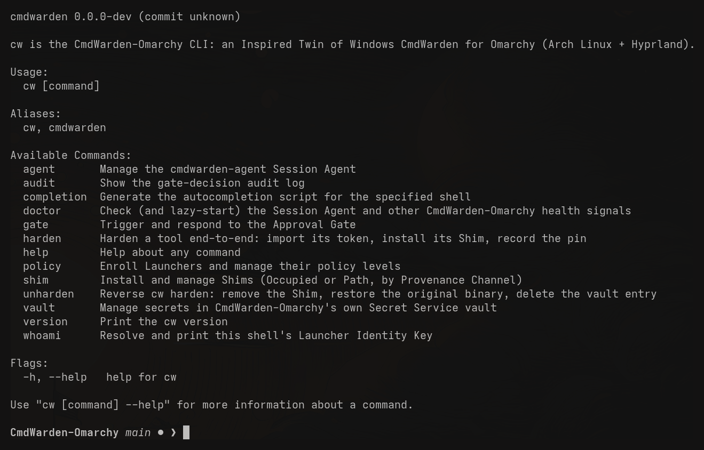
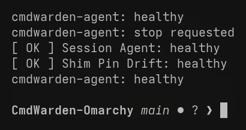
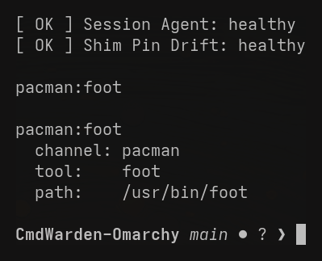
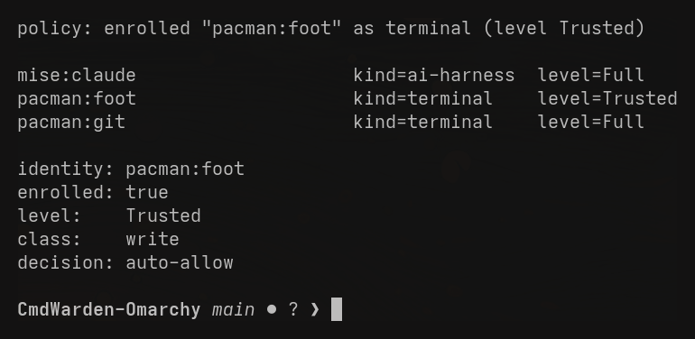
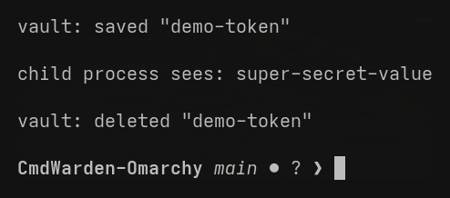
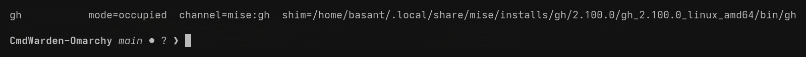
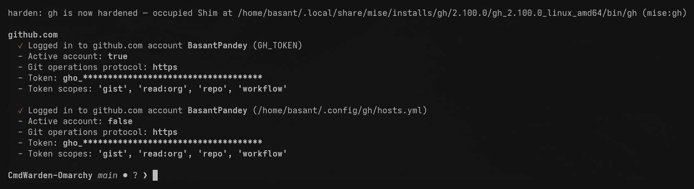
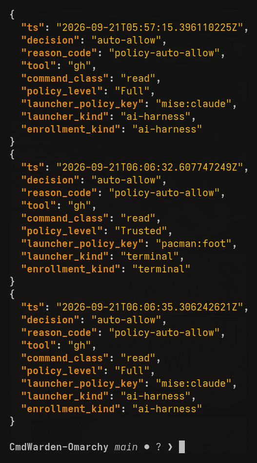

# CLI reference

`cw` (alias `cmdwarden`) is the only binary you invoke directly.
`cmdwarden-agent` runs in the background, lazy-started by systemd — you
normally never invoke it yourself. Every screenshot below is a real
terminal session on a real Omarchy machine, not a mockup.

```sh
cw version
cw help
cw <command> --help
```



## Agent lifecycle

```sh
cw doctor                # lazy-starts the agent if needed, reports health
                          # (Session Agent reachability, Shim Pin Drift)
cw agent status           # is the agent running and healthy right now?
cw agent stop             # stop the running agent
cw agent install           # write + enable the systemd --user socket unit
cw agent uninstall         # stop, disable, and remove the unit files
```

`cw doctor` is what actually starts the agent the first time — there's no
separate "start" command, because you're never supposed to need one:

```sh
$ cw agent status
cmdwarden-agent: healthy
$ cw agent stop
cmdwarden-agent: stop requested
$ cw doctor
[ OK ] Session Agent: healthy
[ OK ] Shim Pin Drift: healthy
$ cw agent status
cmdwarden-agent: healthy
```



## Identity

```sh
cw whoami                 # print this shell's resolved Identity Key
cw whoami -v               # ...plus channel/tool/path/hash
```

Run from an AI harness (Claude Code, in this case) and from a plain terminal
(`foot`), the *same command* resolves two different real identities — this
is what every policy decision and audit row is keyed on:

```sh
$ cw whoami            # from inside Claude Code
mise:claude
$ cw whoami            # from a plain foot terminal
pacman:foot
```



## Policy

```sh
cw policy enroll --kind ai-harness|terminal [--key <identity-key>]
                          # enroll a Launcher (defaults to the caller,
                          # resolved the same way `cw whoami` does).
                          # ai-harness -> Read, terminal -> Trusted.
cw policy list             # list every enrolled Launcher and its level
cw policy set <identity-key> <Deny|Read|Trusted|Full>
cw policy unenroll <identity-key>
cw policy check [--identity <key>] --class read|write|secret-reveal|unknown
                          # dry-run the policy decision without running
                          # anything gated
```

```sh
$ cw policy enroll --kind terminal
policy: enrolled "pacman:foot" as terminal (level Trusted)
$ cw policy list
mise:claude                    kind=ai-harness  level=Full
pacman:foot                    kind=terminal    level=Trusted
pacman:git                     kind=terminal    level=Full
$ cw policy check --class write
identity: pacman:foot
enrolled: true
level:    Trusted
class:    write
decision: auto-allow
```



## Vault

```sh
cw vault save <name>       # prompts (hidden input) or reads stdin if piped
cw vault delete <name>
cw vault import gh [--hostname github.com]
                          # import gh's currently active token
cw vault exec --secret <name> --env <VAR> -- <command> [args...]
                          # release a secret into exactly one child
                          # process's environment; never printed or logged
```

```sh
$ echo -n "super-secret-value" | cw vault save demo-token
vault: saved "demo-token"
$ cw vault exec --secret demo-token --env DEMO_TOKEN -- \
    sh -c 'echo "child process sees: $DEMO_TOKEN"'
child process sees: super-secret-value
$ cw vault delete demo-token
vault: deleted "demo-token"
```

Note what's *not* in that transcript: the value never appears until the one
child process that asked for it prints it itself — `cw vault exec` never
echoes it, and it's never set in the calling shell's own environment.



## Shim

```sh
cw shim install --tool <name> [--path <explicit-binary-path>]
                          # installs Occupied (mise) or Path (pacman) Shim,
                          # branching automatically by Provenance Channel
cw shim uninstall --tool <name>
cw shim list
```

```sh
$ cw shim list
gh    mode=occupied  channel=mise:gh  shim=/home/.../mise/installs/gh/2.100.0/.../gh
```



## Harden (gh only, in this spike vertical)

```sh
cw harden gh [--hostname github.com]
                          # resolve gh's PATH, import its token, install
                          # the Shim, record the pin. Safe to re-run at
                          # any time (removes a stale pin first).
cw unharden gh [--hostname github.com]
                          # remove the Shim, restore the real binary,
                          # delete the vault entry
```

This is the payoff: after `cw harden gh`, `gh` itself reports its active
token is coming from `GH_TOKEN` (the vault-injected one), not its own
`hosts.yml`:

```sh
$ cw harden gh
harden: gh is now hardened — occupied Shim at /home/.../gh (mise:gh)
$ gh auth status
github.com
  ✓ Logged in to github.com account BasantPandey (GH_TOKEN)
  - Active account: true
  ...
```



## Approval Gate

```sh
cw gate test [--identity <key>] --tool <name> --command "<display line>" \
             --class read|write|secret-reveal|unknown
                          # trigger a real Approval Gate popup with the
                          # caller's real identity/policy and fake command
                          # data — for testing the gate itself
```

`cw gate test` pops the *real* Approval Gate UI — the same Wayland
layer-shell surface a real gated `gh` call uses — with whatever data you
give it:

```sh
$ cw gate test --identity mise:claude --tool gh --class write \
    --command 'gh pr create --title "Add dark mode toggle" --body "..."'
gate: popping Approval Gate for mise:claude running gh (class=write, policy=Full)...
gate: decision = allow-once
```


`cw gate respond` also exists but is hidden: it's what the gate UI's own
buttons invoke, never meant for direct use.

## Audit

```sh
cw audit                  # dump the whole gate-decision log (NDJSON)
cw audit --follow          # ...and keep tailing it
cw audit prune             # drop rows older than the retention window (30d)
```

```sh
$ cw audit | tail -3 | jq .
{
  "ts": "2026-09-21T06:06:35.306242621Z",
  "decision": "auto-allow",
  "reason_code": "policy-auto-allow",
  "tool": "gh",
  "command_class": "read",
  "policy_level": "Full",
  "launcher_policy_key": "mise:claude",
  "launcher_kind": "ai-harness",
  "enrollment_kind": "ai-harness"
}
```


